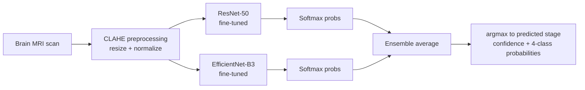
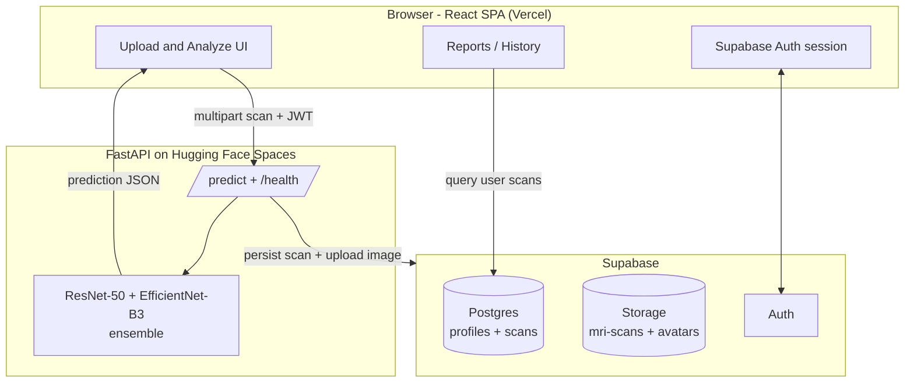

<div align="center">

# 🧠 NeuroScan AI

### AI-Powered Alzheimer's Disease Detection from Brain MRI Scans

Upload a brain MRI, get an instant four-stage Alzheimer's classification backed by a
deep-learning ensemble — with confidence scores, per-class probabilities and
explainable heatmaps.

[](https://react.dev)
[](https://www.typescriptlang.org)
[](https://vitejs.dev)
[](https://tailwindcss.com)
[](https://supabase.com)
[](https://fastapi.tiangolo.com)
[](#-license)

**[Live Demo](https://clarity-scan-blond.vercel.app)** · **[Report a Bug](../../issues)** · **[Request a Feature](../../issues)**

</div>

> [!WARNING]
> **NeuroScan AI is a research and educational screening tool — not a medical device.**
> Its output is **not a clinical diagnosis**. Model predictions must always be reviewed and
> confirmed by a qualified neurologist or radiologist. Do not use it for real diagnostic or
> treatment decisions.

---

## Table of Contents

- [Overview](#overview)
- [Key Features](#key-features)
- [The Machine Learning Model](#the-machine-learning-model)
  - [Problem Framing](#problem-framing)
  - [Ensemble Architecture](#ensemble-architecture)
  - [Preprocessing Pipeline](#preprocessing-pipeline)
  - [Training Data](#training-data)
  - [Performance](#performance)
  - [Explainability (Grad-CAM)](#explainability-grad-cam)
  - [Inference API Contract](#inference-api-contract)
- [System Architecture](#system-architecture)
- [Tech Stack](#tech-stack)
- [Getting Started](#getting-started)
- [Environment Variables](#environment-variables)
- [Available Scripts](#available-scripts)
- [Project Structure](#project-structure)
- [Data Model](#data-model)
- [Deployment](#deployment)
- [Security](#security)
- [Roadmap](#roadmap)
- [Disclaimer](#disclaimer)
- [License](#license)

---

## Overview

**NeuroScan AI** is a full-stack web platform that screens brain MRI scans for signs of
Alzheimer's Disease and classifies them into **four clinical stages**. A user uploads an MRI
image through the browser; the scan is sent to a FastAPI inference service running a
**ResNet-50 + EfficientNet-B3 ensemble**, and results are returned in seconds — a predicted
stage, an overall confidence score, and a full probability breakdown across all four classes.

The platform pairs the diagnostic workflow with patient education (an "About Alzheimer's"
knowledge base covering stages, symptoms and prevention) and a personal scan history so users
can track results over time.

| | |
|---|---|
| **Purpose** | Fast, accessible first-pass Alzheimer's screening from MRI |
| **Output classes** | Non Demented · Very Mild Demented · Mild Demented · Moderate Demented |
| **Model** | ResNet-50 + EfficientNet-B3 ensemble with CLAHE preprocessing |
| **Reported accuracy** | ~75% overall · 100% precision on Moderate cases |
| **Latency** | Typically under 30 seconds per scan |
| **Frontend** | React 18 + TypeScript + Vite SPA |
| **Backend** | FastAPI inference API (Hugging Face Spaces) |
| **Auth / Data** | Supabase (Auth, Postgres, Storage) |

---

## Key Features

- **🔬 One-click MRI analysis** — drag-and-drop upload (JPG / PNG / DICOM, up to 10 MB) with
  instant client-side preview and validation.
- **🧩 Four-stage classification** — maps each scan to `NonDemented`, `VeryMildDemented`,
  `MildDemented`, or `ModerateDemented`.
- **📊 Rich result view** — headline prediction card, confidence score, a horizontal
  probability bar chart (Recharts) and an animated per-class breakdown.
- **🔥 Grad-CAM heatmaps** — visual explanation overlay highlighting the brain regions that
  drove the prediction *(rolling out — see [Roadmap](#roadmap))*.
- **📁 Scan history & reports** — every analysis is persisted per user and browsable from the
  Reports page with status badges (Pending / Done / Failed).
- **📚 Patient education** — a dedicated "About Alzheimer's" section covering the four stages,
  ten early warning signs, prevention strategies and an FAQ.
- **🔐 Secure accounts** — Supabase-backed email/password auth, protected routes, and
  user-scoped data isolation.
- **✨ Polished UX** — animated, fully responsive UI (Framer Motion + Tailwind + shadcn/ui),
  WebGL "DarkVeil" background, and mobile-first flows with resilient network handling.

---

## The Machine Learning Model

The intelligence behind NeuroScan AI is a **convolutional neural network ensemble** trained to
distinguish the four progressive stages of Alzheimer's Disease from structural MRI slices.

### Problem Framing

Alzheimer's classification is modelled as a **4-class supervised image classification** task.
Given a single 2D axial brain MRI slice, the model outputs a probability distribution over four
mutually exclusive stages:

| Class | Meaning | Clinical signal |
|-------|---------|-----------------|
| `NonDemented` | No significant signs of Alzheimer's detected | Baseline / healthy |
| `VeryMildDemented` | Very early-stage indicators | Subtle atrophy begins |
| `MildDemented` | Mild cognitive impairment | Noticeable hippocampal/cortical change |
| `ModerateDemented` | Significant cognitive impairment | Pronounced structural loss |

The predicted class is the `argmax` of the ensemble probability vector; the reported
**confidence** is that winning class's probability.

### Ensemble Architecture

Rather than relying on a single network, NeuroScan AI averages two complementary,
ImageNet-pretrained backbones that are fine-tuned on the MRI dataset. Ensembling reduces the
variance of any one model and improves robustness on the harder, under-represented stages.



| Backbone | Why it's in the ensemble |
|----------|--------------------------|
| **ResNet-50** | Deep residual connections capture rich hierarchical features and train stably; a proven, high-capacity baseline for medical imaging. |
| **EfficientNet-B3** | Compound-scaled architecture delivering strong accuracy at a favourable parameter/compute budget — captures fine-grained texture the ResNet may miss. |

Each backbone's final classification head is replaced with a 4-way output layer and fine-tuned
on the Alzheimer's MRI data. At inference, both models' softmax outputs are **averaged** into a
single ensemble distribution.

### Preprocessing Pipeline

Every uploaded scan passes through the same deterministic pipeline before it reaches the
networks — this is what the analysis progress UI surfaces stage-by-stage:

1. **Decode & sanity-check** the incoming image (type + size validated client-side, re-checked
   server-side).
2. **CLAHE** — *Contrast Limited Adaptive Histogram Equalization.* Enhances local contrast so
   subtle structural details (atrophy, ventricular enlargement) become more separable, while
   clipping limits amplifying noise.
3. **Resize** to each backbone's expected input resolution.
4. **Normalize** channel statistics to match the ImageNet pretraining distribution.
5. **Ensemble forward pass** → ResNet-50 and EfficientNet-B3 → averaged probabilities.

### Training Data

The model is trained on a labelled **4-class Alzheimer's brain-MRI dataset** (Kaggle-derived),
with the four stages above as targets. The class distribution is naturally **imbalanced** —
`ModerateDemented` is by far the rarest presentation — so **data augmentation** (flips,
rotations, contrast/intensity jitter) is used to expand and balance the training set to on the
order of **~34,000 images**. Class imbalance is the key reason the ensemble and per-class
metrics (below) matter more than a single accuracy number.

### Performance

> Metrics are reported on a held-out test split and reflect the current production model.

| Metric | Value |
|--------|-------|
| Overall accuracy | **~75%** |
| Precision — `ModerateDemented` | **100%** |
| Output classes | 4 |
| Typical inference latency | < 30 s per scan |

The standout **100% precision on Moderate cases** means that when the model flags the most
advanced stage, it is highly reliable — the failure mode of most concern (false alarms on the
severe class) is minimized. Overall accuracy sits at ~75%, which is why the platform is framed
as a **screening aid**, not a diagnostic authority.

### Explainability (Grad-CAM)

To keep predictions interpretable rather than black-box, the results view is built to display a
**Grad-CAM** (Gradient-weighted Class Activation Mapping) heatmap alongside the original scan.
Grad-CAM highlights the spatial regions the network weighted most heavily for its decision,
letting a clinician sanity-check *where* the model "looked."

> The results UI already renders an original-vs-overlay comparison; the fully model-derived
> Grad-CAM heatmap is being wired end-to-end (tracked in the [Roadmap](#roadmap)).

### Inference API Contract

The frontend talks to the FastAPI service over two endpoints.

**Health / wake-up** — called on page load because Hugging Face Spaces cold-start after
inactivity:

```http
GET /health
```

**Predict** — multipart upload; the server handles storage + DB persistence and returns the
prediction:

```http
POST /predict
Authorization: Bearer <supabase_access_token>
Content-Type: multipart/form-data

file=<mri_image>
user_id=<supabase_user_id>
```

**Response**

```jsonc
{
  "prediction": "MildDemented",        // argmax class
  "confidence": 0.87,                   // winning class probability (0-1)
  "probabilities": {                    // full ensemble distribution
    "NonDemented": 0.04,
    "VeryMildDemented": 0.06,
    "MildDemented": 0.87,
    "ModerateDemented": 0.03
  },
  "scan_id": "uuid"                     // persisted scan record id
}
```

Requests are guarded with a **2-minute timeout** (to tolerate Space cold-starts) and a smooth
progress crawl so mobile users always see the request is in flight.

---

## System Architecture



**Flow:** the SPA authenticates via Supabase, sends the MRI (plus the user's JWT and id) to the
FastAPI `/predict` endpoint, the service runs the ensemble and persists the scan + result to
Supabase, and the UI renders the returned probabilities. The Reports page reads scan history
back directly from Supabase Postgres.

---

## Tech Stack

| Layer | Technology |
|-------|-----------|
| **Framework** | React 18 · TypeScript · Vite 5 (SWC) |
| **Styling** | Tailwind CSS 3 · shadcn/ui (Radix primitives) · `tailwindcss-animate` |
| **Animation / 3D** | Framer Motion · OGL (WebGL "DarkVeil" background) |
| **Routing** | React Router v6 (protected routes + animated transitions) |
| **Data / state** | TanStack Query · React Hook Form · Zod validation |
| **Charts** | Recharts |
| **Auth / DB / Storage** | Supabase (`@supabase/supabase-js`) |
| **ML inference** | FastAPI service (ResNet-50 + EfficientNet-B3 ensemble) on Hugging Face Spaces |
| **Testing** | Vitest · Testing Library · jsdom |
| **Tooling** | ESLint 9 · TypeScript ESLint · PostCSS · Autoprefixer |
| **Hosting** | Vercel (SPA rewrites + CSP headers) |

---

## Getting Started

### Prerequisites

- **Node.js** ≥ 18 (LTS recommended)
- **npm**, **bun**, or **pnpm**
- A **Supabase** project (for auth, database and storage)
- Access to the **inference API** (the hosted Hugging Face Space, or a local FastAPI instance)

### Installation

```sh
# 1. Clone the repository
git clone <YOUR_GIT_URL>
cd rtp-frontend

# 2. Install dependencies
npm install          # or: bun install

# 3. Configure environment (see below)
cp .env.example .env # then fill in your values

# 4. Start the dev server
npm run dev          # http://localhost:8080
```

---

## Environment Variables

Create a `.env` file in the project root:

```env
# Supabase
VITE_SUPABASE_URL=https://<your-project>.supabase.co
VITE_SUPABASE_ANON_KEY=<your-supabase-anon-key>

# ML inference API
# Local dev default:
VITE_API_URL=http://127.0.0.1:8000
# Production example:
# VITE_API_URL=https://<your-space>.hf.space
```

| Variable | Description |
|----------|-------------|
| `VITE_SUPABASE_URL` | Your Supabase project URL |
| `VITE_SUPABASE_ANON_KEY` | Supabase public anon key (safe for the browser) |
| `VITE_API_URL` | Base URL of the FastAPI inference service (falls back to `http://127.0.0.1:8000`) |

> `.env.production` holds the production values used at build time. All client-exposed vars
> **must** be prefixed with `VITE_`.

---

## Available Scripts

| Script | Description |
|--------|-------------|
| `npm run dev` | Start the Vite dev server on port `8080` (HMR) |
| `npm run build` | Production build to `dist/` |
| `npm run build:dev` | Development-mode build (source-maps / unminified) |
| `npm run preview` | Preview the production build locally |
| `npm run lint` | Run ESLint across the project |
| `npm run test` | Run the Vitest suite once |
| `npm run test:watch` | Run Vitest in watch mode |

---

## Project Structure

```
rtp-frontend/
├── public/                     # Static assets
├── src/
│   ├── assets/                 # Images (hero-brain, etc.)
│   ├── components/
│   │   ├── ui/                 # shadcn/ui primitives (generated)
│   │   ├── DarkVeil.tsx        # WebGL animated background
│   │   ├── Logo.tsx
│   │   └── NavLink.tsx
│   ├── hooks/
│   │   ├── useAuth.ts          # Supabase auth + profile lifecycle
│   │   ├── use-mobile.tsx
│   │   └── useScrollAnimation.ts
│   ├── lib/
│   │   ├── supabase.ts         # Supabase client
│   │   └── utils.ts
│   ├── pages/
│   │   ├── HomePage.tsx         # Landing + stats + "how it works"
│   │   ├── AuthPage.tsx         # Login / signup
│   │   ├── DashboardLayout.tsx  # Authenticated shell (Outlet)
│   │   ├── UploadAnalyzePage.tsx# Core MRI upload + inference flow
│   │   ├── ReportsPage.tsx      # Scan history
│   │   ├── ProfilePage.tsx      # Profile + settings
│   │   ├── AboutAlzheimersPage.tsx # Education / FAQ
│   │   └── NotFound.tsx
│   ├── App.tsx                 # Router + providers + layout
│   └── main.tsx                # Entry point
├── index.html                  # CSP, fonts, meta
├── vite.config.ts              # Vite + manual chunking
├── vercel.json                 # SPA rewrites + CSP headers
├── tailwind.config.ts
└── tsconfig.json
```

The heart of the app is [`src/pages/UploadAnalyzePage.tsx`](src/pages/UploadAnalyzePage.tsx) —
it owns the upload → analyze → results state machine, the API call, progress animation and the
probability visualizations.

---

## Data Model

Persisted in **Supabase Postgres**:

**`profiles`**

| Column | Type | Notes |
|--------|------|-------|
| `id` | uuid (PK) | Matches `auth.users.id` |
| `full_name` | text | Nullable |
| `avatar_url` | text | Nullable |
| `updated_at` | timestamp | |

**`scans`**

| Column | Type | Notes |
|--------|------|-------|
| `id` | uuid (PK) | |
| `user_id` | uuid (FK) | Owner |
| `image_path` | text | Path in the `mri-scans` bucket |
| `prediction` | text | Predicted class (nullable until done) |
| `confidence` | float | 0–1 (nullable until done) |
| `status` | text | `pending` · `done` · `failed` |
| `created_at` | timestamp | |

**Storage buckets:** `mri-scans` (uploaded MRIs), `avatars` (profile pictures).

---

## Deployment

The app is a static SPA deployed on **Vercel**.

- **`vercel.json`** rewrites all routes to `index.html` (client-side routing) and sets a strict
  **Content-Security-Policy**, restricting `connect-src` to Supabase and the inference API host.
- Configure `VITE_*` variables in the Vercel project settings (or via `.env.production`).
- The inference backend is hosted separately as a **FastAPI app on Hugging Face Spaces**; the
  frontend wakes it via `GET /health` on load to mitigate cold-starts.

```sh
npm run build      # outputs dist/
# deploy dist/ via Vercel (or any static host)
```

**Live deployment:** https://clarity-scan-blond.vercel.app

---

## Security

- **Auth:** Supabase email/password with session-based access tokens; the token is sent as a
  `Bearer` credential on every `/predict` call.
- **Route protection:** `ProtectedRoute` gates all `/dashboard/*` routes and redirects
  unauthenticated users to `/auth`.
- **Data isolation:** scans and profiles are queried by `user_id`; enforce this with
  **Row-Level Security** policies on the Supabase side.
- **Content-Security-Policy:** locked down in both `index.html` and `vercel.json` — scripts,
  styles, fonts and network egress are allow-listed to known hosts only.
- **Client-side validation:** file type (JPG/PNG/DICOM) and size (≤ 10 MB) are checked before
  upload and re-validated server-side.

---

## Roadmap

- [ ] **Grad-CAM heatmaps** — end-to-end model-derived explainability overlay on the results page.
- [ ] **PDF report export** — downloadable, shareable clinical-style report.
- [ ] **Email to doctor** — send results directly to a specialist.
- [ ] **Specialist finder** — locate nearby neurologists.
- [ ] **Native DICOM rendering** — full DICOM parsing and window/level controls.
- [ ] **Model card & metrics dashboard** — public, versioned model performance reporting.

---

## Disclaimer

NeuroScan AI is provided for **research, educational and screening-assistance purposes only**.
It is **not** an FDA-cleared medical device and its predictions do **not** constitute a medical
diagnosis. Alzheimer's Disease is diagnosed by qualified clinicians using comprehensive
assessment — clinical history, cognitive testing, and multiple imaging/lab modalities. Always
consult a licensed medical professional. The authors accept no liability for decisions made on
the basis of this tool's output.

---

## License

Released under the **MIT License**. See [`LICENSE`](LICENSE) for details.

<div align="center">

Built with 🧠 and ⚛️ — **NeuroScan AI**

</div>
